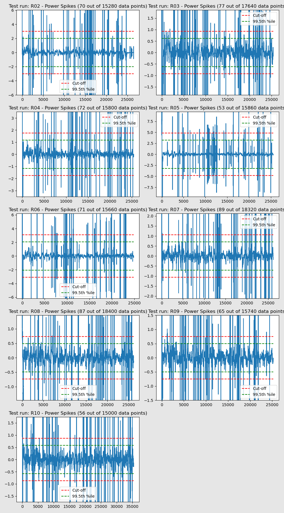
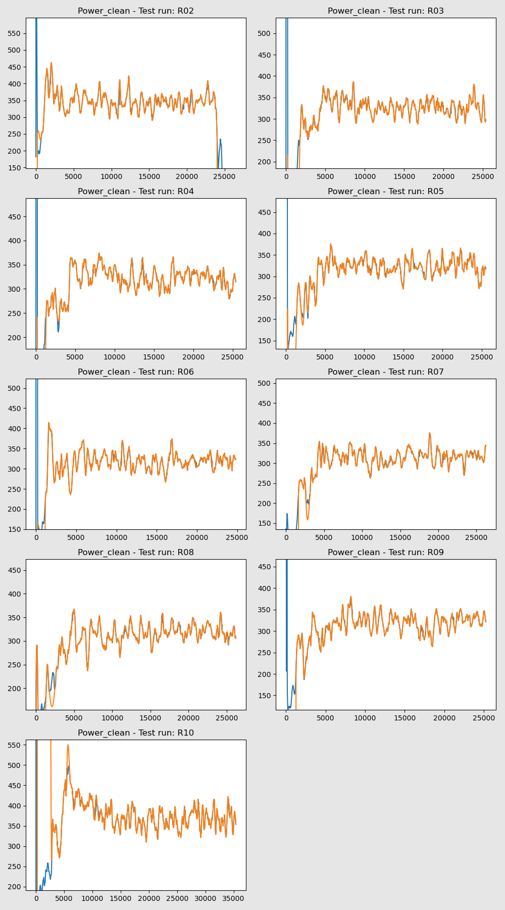

Various plots and data tables to help Validate data for all Test Runs  
### Data Issues  
- [Missing Data Records](MissingDataRecs.html)  
- [Global Vs Public field discrepancies](GlobalVsPublic_Fields.html)  
- [Speed Quantisation](SpeedFromOdoCount.html)  
- [Speed derivation options](OdoRevTime_Speed.html)  
- [Speed from Crank Angle](SpeedFromCrankAngle.html)  
- [Ground Speeds Compared](GroundSpeeds.html)  
- [Air Densities Compared](AirDensities.html)  
- [Air Speeds Compared](AirSpeeds.html)  
- [Wind Speeds Compared](WindSpeeds.html)  
- [Accelerations Compared](Accelerations.html)  
- [Lean Angles Compared](LeanAngles.html)  
- [Rider CdAs Compared](RiderCdAs.html)  

#### Data Outliers  
- [Summary of Data Outliers](DataPeaks.html) 
- [AirSpeed-Peaks](AirSpeed-Peaks.html)
- [Cadence-Peaks](Cadence-Peaks.html)
- [CadenceSpeed-Peaks](CadenceSpeed-Peaks.html)
- [CdA-Peaks](CdA-Peaks.html)
- [CrankAngleDelta-Peaks](CrankAngleDelta-Peaks.html)
- [CrankSpeed-Peaks](CrankSpeed-Peaks.html)
- [Drag-Peaks](Drag-Peaks.html)
- [GroundSpeed-Peaks](GroundSpeed-Peaks.html)
- [OdoCountSpeed-Peaks](OdoCountSpeed-Peaks.html)
- [OdoRevTimeSpeed-Peaks](OdoRevTimeSpeed-Peaks.html)
- [Orig_Ground_Speed-Peaks](Orig_Ground_Speed-Peaks.html)
- [Power-Peaks](Power-Peaks.html)
- [TotalWeight-Peaks](TotalWeight-Peaks.html)
- [Total_P-Peaks](Total_P-Peaks.html)
- [Weight-Peaks](Weight-Peaks.html)

#### Data Spikes  
- [Summary of Data Spikes](DataSpikes.html) 
- [Big Data Spikes sample](BigDataSpikes.html) 
- [AirSpeed-Spikes](AirSpeed-Spikes.html)
- [Cadence-Spikes](Cadence-Spikes.html)
- [CadenceSpeed-Spikes](CadenceSpeed-Spikes.html)
- [CdA-Spikes](CdA-Spikes.html)
- [CrankAngleDelta-Spikes](CrankAngleDelta-Spikes.html)
- [CrankSpeed-Spikes](CrankSpeed-Spikes.html)
- [Drag-Spikes](Drag-Spikes.html)
- [GroundSpeed-Spikes](GroundSpeed-Spikes.html)
- [OdoCountSpeed-Spikes](OdoCountSpeed-Spikes.html)
- [OdoRevTimeSpeed-Spikes](OdoRevTimeSpeed-Spikes.html)
- [Orig_Ground_Speed-Spikes](Orig_Ground_Speed-Spikes.html)
- [Power-Spikes](Power-Spikes.html)
- [TotalWeight-Spikes](TotalWeight-Spikes.html)
- [Total_P-Spikes](Total_P-Spikes.html)
- [Weight-Spikes](Weight-Spikes.html)

#### Data Cleaned  
- [Summary of Impact of Cleaning Data ](DataCleaned.html) 
- [AirSpeed-Cleaned](AirSpeed-Cleaned.html)
- [Cadence-Cleaned](Cadence-Cleaned.html)
- [CadenceSpeed-Cleaned](CadenceSpeed-Cleaned.html)
- [CdA-Cleaned](CdA-Cleaned.html)
- [CrankAngleDelta-Cleaned](CrankAngleDelta-Cleaned.html)
- [CrankSpeed-Cleaned](CrankSpeed-Cleaned.html)
- [Drag-Cleaned](Drag-Cleaned.html)
- [GroundSpeed-Cleaned](GroundSpeed-Cleaned.html)
- [OdoCountSpeed-Cleaned](OdoCountSpeed-Cleaned.html)
- [OdoRevTimeSpeed-Cleaned](OdoRevTimeSpeed-Cleaned.html)
- [Orig_Ground_Speed-Cleaned](Orig_Ground_Speed-Cleaned.html)
- [Power-Cleaned](Power-Cleaned.html)
- [TotalWeight-Cleaned](TotalWeight-Cleaned.html)
- [Total_Fx-Cleaned](Total_Fx-Cleaned.html)
- [Total_Fy-Cleaned](Total_Fy-Cleaned.html)
- [Total_P-Cleaned](Total_P-Cleaned.html)

